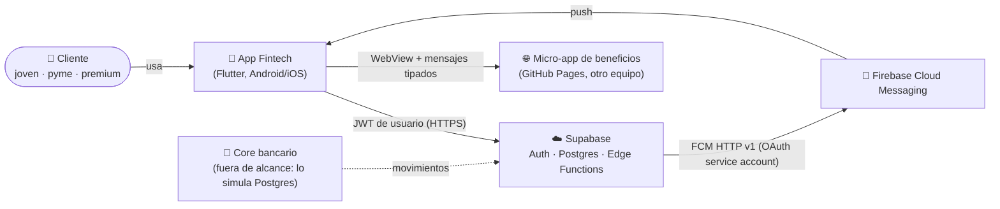
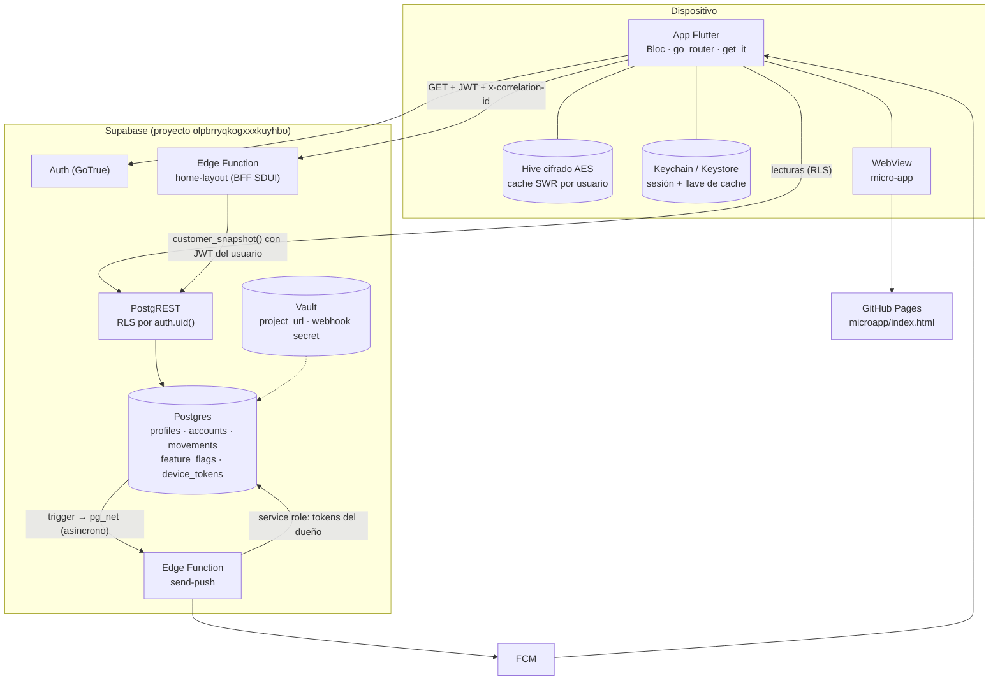
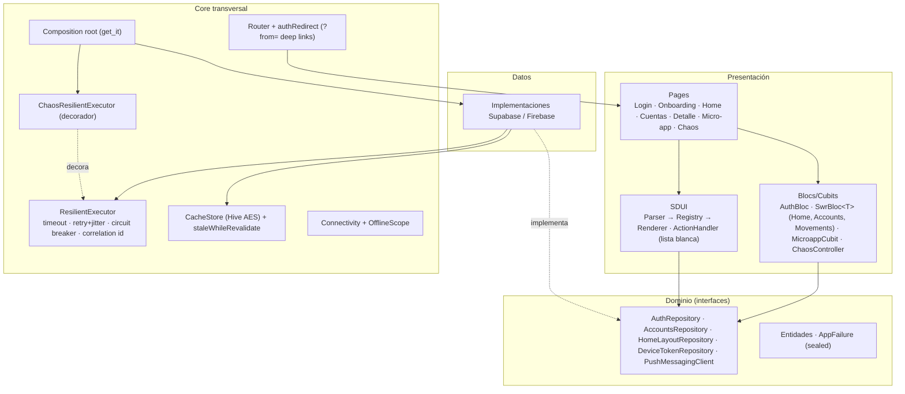
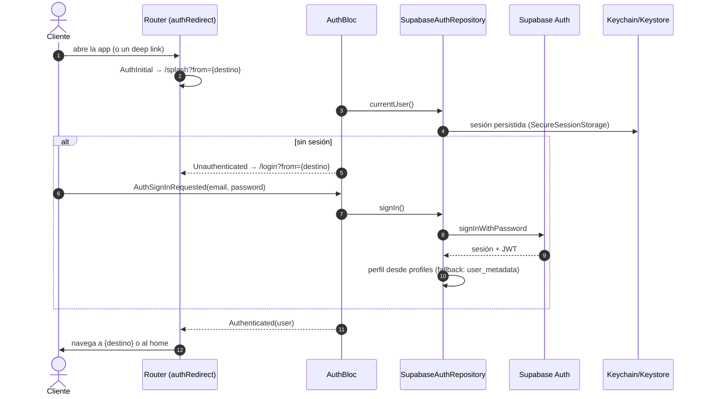
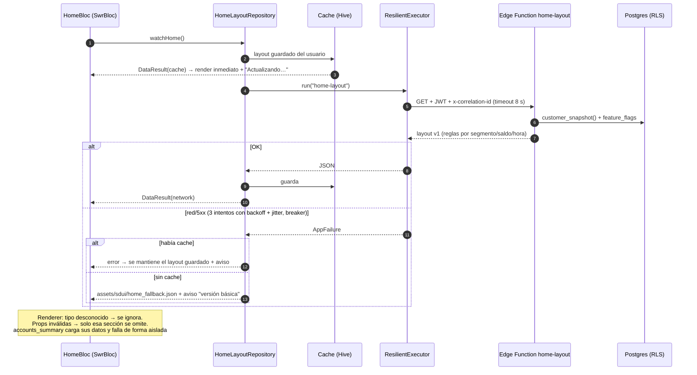
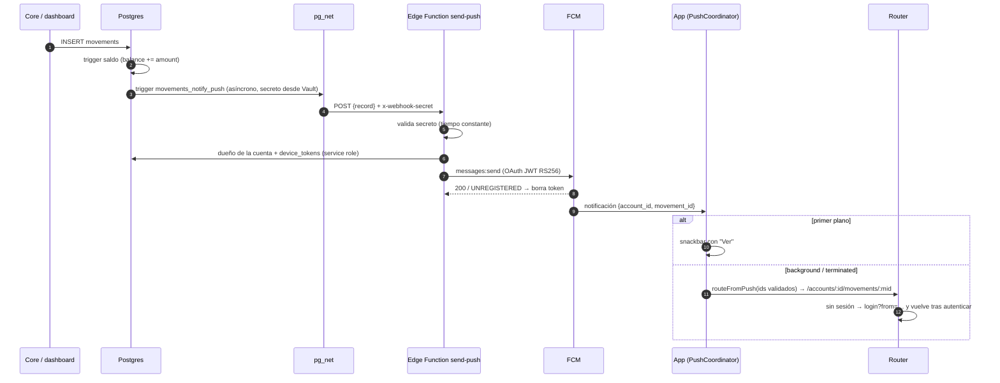

# Arquitectura

Plataforma financiera 100 % digital construida en Flutter sobre Supabase. Este documento describe el sistema de afuera hacia adentro (C4), los flujos críticos, los supuestos, los riesgos y cómo escala hacia un ecosistema de dominios administrados por equipos independientes. Las decisiones están detalladas en [`docs/adr/`](adr/).

## Principios

1. **El servidor decide la experiencia, la app decide la seguridad.** El home es Server-Driven UI; la app valida todo lo que recibe (contrato versionado, acciones con lista blanca, ids validados en deep links).
2. **Degradar, nunca romper.** Cada lectura tiene camino red → cache → contenido empaquetado; una sección o servicio caído no tumba la pantalla.
3. **Bordes reemplazables.** Las features dependen de interfaces de `domain`; las implementaciones se cablean en un único composition root (`core/di/injection.dart`). Así se testean con fakes y se decoran (chaos) sin tocar el código de negocio.
4. **Mínimo privilegio.** RLS en todas las tablas, el cliente no escribe dinero, la service role solo vive en Edge Functions, la micro-app nunca recibe el token.

## C4 — Nivel 1: Contexto

## C4 — Nivel 2: Contenedores

| Contenedor | Responsabilidad | Tecnología |
|------------|-----------------|------------|
| App | UI, estado, navegación, resiliencia, cache, push | Flutter 3.38.9, Bloc, go_router, get_it, Hive CE, webview_flutter, firebase_messaging |
| PostgREST | Lecturas directas de cuentas y movimientos; RLS garantiza aislamiento | Supabase |
| `home-layout` | BFF de personalización: junta señales del cliente + flags y devuelve el layout SDUI v1 | Deno, reglas puras testeadas |
| `send-push` | Convierte un movimiento nuevo en notificación FCM; limpia tokens inválidos | Deno, OAuth RS256 con WebCrypto |
| Micro-app | Marketplace de beneficios desplegable de forma independiente | HTML/JS sin dependencias, CSP |

## C4 — Nivel 3: Componentes de la app

**Estructura de carpetas** (feature-first, Clean Architecture por feature): `lib/core` (transversal), `lib/sdui`, `lib/design_system`, `lib/features/{auth, accounts, home, notifications, marketplace, debug}/{domain, data, presentation}`. Las dependencias apuntan hacia `domain`; `presentation` nunca importa `data`.

## Flujos críticos

### Login y restauración de sesión

### Home SDUI con degradación

### Push con deep link

### Registro del dispositivo

Login → permiso de notificaciones → `getToken()` → RPC `register_device_token` (upsert idempotente que reasigna el token si otro usuario lo tenía en el mismo teléfono) → escucha `onTokenRefresh`. Logout → `deleteToken()`; el siguiente envío a ese token devuelve `UNREGISTERED` y `send-push` lo elimina.

## Modelo de datos y seguridad

| Tabla | Cliente puede | Notas |
|-------|---------------|-------|
| `profiles` | leer el suyo, cambiar `full_name` | `segment` no editable por el cliente |
| `accounts` | leer las suyas | `balance` = Σ movimientos, mantenido por trigger |
| `movements` | leer los de sus cuentas | escritura solo desde el core / service role |
| `feature_flags` | leer | escritura solo dashboard / service role |
| `device_tokens` | leer / borrar los suyos | alta vía RPC `register_device_token` |

Dinero en `numeric(14,2)` en la base y en centavos (`int`) en la app. Secretos: publishable key en la app (pública por diseño), service role y service account solo en secrets de Supabase, secreto del webhook en Vault. Configuración de Firebase fuera del repo ([ADR-0011](adr/0011-configuracion-firebase-fuera-del-repo.md)).

## Comportamiento ante red limitada y fallas

| Situación | Comportamiento |
|-----------|----------------|
| Latencia alta | Skeleton al inicio; con datos previos, "Actualizando…" sin bloquear; timeout de 8 s por intento |
| Errores transitorios | 3 intentos, backoff exponencial con full jitter (0,3 → 3 s), solo operaciones idempotentes |
| Servicio caído | Circuit breaker por servicio (3 fallos → abierto 15 s) evita martillar el backend; resto de servicios sigue |
| Sin conexión | Banner global; datos guardados con "Datos guardados · hace X min"; al reconectar se refresca solo |
| `home-layout` caído | Último layout guardado o layout empaquetado ("versión básica") |
| Cuentas caídas | Solo la tarjeta de saldo muestra error con reintento |
| Micro-app caída / lenta | Error de red o timeout de 10 s con reintento |
| Push no configurado | La app arranca sin push (p. ej. iOS) |

Todo esto se demuestra en vivo con el panel chaos (`/debug`), que decora el executor sin tocar repositorios.

## Supuestos

- El "core bancario" está fuera de alcance; Postgres + triggers lo simulan (saldo derivado de movimientos).
- Usuarios de prueba creados en Supabase Auth; confirmación de email desactivada para la demo.
- Android es la plataforma objetivo de la demo; iOS compila pero push (APNs) queda pendiente.
- Una sola región / un solo ambiente (el proyecto de Supabase actual hace de dev).
- La micro-app es estática; en producción tendría su propio backend y autenticación delegada.

## Riesgos técnicos y mitigación

| Riesgo | Impacto | Mitigación actual | Siguiente paso |
|--------|---------|-------------------|----------------|
| Contrato SDUI evoluciona y rompe apps viejas | Home en blanco | `version`, parser tolerante, tipos desconocidos ignorados, fallback empaquetado | Contract tests backend↔app en CI; versionado por `min_app_version` |
| El servidor envía acciones peligrosas | Navegación o apertura de URLs arbitrarias | Lista blanca de rutas, solo `https`, ids validados en push | Firmar layouts |
| Dependencia de un BaaS (Supabase) | Lock-in, límites de plan | Repositorios detrás de interfaces; BFF en Edge Functions | Extraer BFF a servicio propio si crece (ADR-0004) |
| Datos financieros en el dispositivo | Fuga en dispositivo comprometido | Hive cifrado AES, llave en Keychain/Keystore, claves por usuario, borrado en logout | Root/jailbreak detection, `FLAG_SECURE` |
| Push perdidos o duplicados | Cliente no se entera | pg_net asíncrono no bloquea inserts; limpieza de tokens | Outbox con reintentos y deduplicación |
| WebView como superficie de ataque | Phishing / XSS | Navegación restringida al origen, CSP, protocolo validado, sin token | Allowlist de micro-apps firmada; JS sandbox |
| Tests E2E con fakes no detectan fallos de integración | Regresiones en prod | RLS check SQL, tests Deno, prueba manual con Supabase real | E2E nocturno contra un proyecto de staging |

## Escalamiento hacia un ecosistema de dominios

**Hoy:** una app, carpetas por feature con fronteras explícitas (cada feature expone `domain` y una página; se comunican por rutas y por el composition root).

**Evolución (sin reescribir):**

1. **Paquetes por equipo con Melos** ([ADR-0001](adr/0001-estructura-modular-vs-melos.md)): `packages/core`, `packages/design_system`, `packages/sdui`, `packages/feature_accounts`, `packages/feature_marketplace`… cada uno con su CODEOWNERS, versionado y CI por paquete afectado. El shell solo compone rutas y DI.
2. **Catálogo SDUI compartido:** cada equipo registra sus componentes en el registry (`SduiRegistry.extend`) y el BFF puede componer secciones de varios dominios; las apps viejas ignoran lo que no conocen.
3. **BFF por dominio:** `home-layout` orquesta; cada dominio publica sus señales/secciones (cuentas, inversiones, beneficios). Si la carga crece se extrae a un servicio dedicado con cache por segmento.
4. **Micro-apps** para capacidades de terceros o de equipos que despliegan más rápido que el ciclo de tiendas; las críticas (pagos, transferencias) se mantienen nativas.
5. **Feature flags por segmento y porcentaje** (hoy por segmento) para rollouts graduales y experimentos.
6. **Ambientes** dev/staging/prod con sabores de Flutter y proyectos separados de Supabase/Firebase, inyectados desde CI ([ADR-0011](adr/0011-configuracion-firebase-fuera-del-repo.md)).
