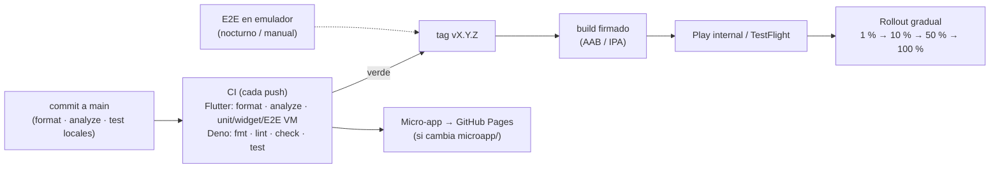

# Operación: despliegue y monitoreo

## 1. Pipeline y despliegue

| Pieza | Cómo se despliega | Rollback |
|-------|-------------------|----------|
| App móvil | Tag `vX.Y.Z` en `main` → `release.yml` (analyze + test + APK de release + GitHub Release con SHA-256). En producción el mismo job firmaría con la llave de upload y subiría el AAB al canal interno → rollout escalonado en tiendas | Detener rollout; hotfix con nuevo tag; apagar la feature por flag |
| Esquema (Postgres) | `supabase db push` desde CI con migraciones versionadas e idempotentes | Migración correctiva (forward-only) |
| Edge Functions | `supabase functions deploy <fn>` desde CI tras `deno test` | Redeploy del commit anterior (son stateless) |
| Home (SDUI) / flags | Deploy de `home-layout` o `update feature_flags` | Inmediato; la app cae a cache/fallback si algo falla |
| Micro-app | Workflow de GitHub Pages | Revert del commit en `microapp/` |

**Ambientes:** `dev` (actual), `staging`, `prod` como proyectos separados de Supabase y Firebase. La app los recibe por `--dart-define-from-file` y la config de Firebase se genera desde secrets por ambiente ([ADR-0011](adr/0011-configuracion-firebase-fuera-del-repo.md)). Sabores de Flutter (`dev`, `stg`, `prod`) con application id distinto para instalarlos en paralelo.

**Dependencias y changelog:** Dependabot abre PRs semanales agrupados (pub y GitHub Actions) que pasan por el mismo CI; las notas de cada release y `CHANGELOG.md` se generan desde los conventional commits con git-cliff.

**Versionado:** SemVer en `pubspec.yaml`; `build_number` = número de ejecución del CI. El contrato SDUI y el protocolo de micro-apps tienen su propia `version`; un cambio incompatible sube la versión y el backend responde según la versión que declare la app.

**Rollout gradual y kill switches:** tiendas (staged rollout) para binarios; `feature_flags` (por segmento, ampliable a porcentaje) para funcionalidades; SDUI para quitar o reordenar secciones del home al instante.

## 2. Monitoreo en producción

### Herramientas

| Necesidad | Herramienta | Punto de integración |
|-----------|-------------|----------------------|
| Crashes y errores no capturados | Firebase Crashlytics (o Sentry) | `FlutterError.onError` y `PlatformDispatcher.onError` en `main.dart`; implementación de `AppLogger` que reenvía `error` |
| Performance (arranque, pantallas, red) | Firebase Performance | Trazas en `ResilientExecutor` (duración por servicio) y en pantallas clave |
| Logs de backend | Supabase Logs (Edge Functions, Postgres, API) | JSON estructurado con `correlationId` |
| Eventos de producto / UX | Analytics (Firebase Analytics / Amplitude) | Eventos de onboarding, primer saldo, acciones SDUI, micro-apps |
| Disponibilidad externa | Uptime checks sobre `home-layout` y la micro-app | Sintéticos cada minuto |

### Trazabilidad de punta a punta

Cada operación lógica de red tiene un `correlationId` (UUID v4) que se mantiene en todos sus reintentos, se registra en la app (`request_ok` / `request_failed` con servicio, intento, ms y tipo de falla) y viaja en el header `x-correlation-id` hasta la Edge Function, que lo incluye en sus logs (`home_layout_ok`, `send_push_done`). Con un id reportado por un cliente se encuentra la petición exacta en Supabase Logs.

### Métricas de experiencia de usuario

| Métrica | Definición | Para qué |
|---------|-----------|----------|
| Abandono en onboarding | % que inicia el paso 1 y no completa el registro (por paso) | Detectar fricción en el alta |
| Tiempo hasta el primer saldo | Desde abrir la app hasta ver `accounts_summary` con datos (cache o red) | Percepción de velocidad; objetivo p75 < 1,5 s con cache |
| % de vistas con datos guardados / fallback | Vistas con "Datos guardados" o "versión básica" sobre el total | Salud real del backend vista por el cliente |
| Reintentos por sesión y tasa de circuit breaker abierto | Desde logs del executor | Inestabilidad de red o de servicios |
| Entrega y apertura de push | `sent` en `send-push` vs aperturas (`push_opened`) | Calidad del canal |
| Errores de micro-app | Timeouts / errores de carga por micro-app | SLA de equipos y terceros |

### SLOs y alertas

| SLI | SLO | Alerta |
|-----|-----|--------|
| Sesiones sin crash | ≥ 99,8 % | < 99,5 % en 1 h, o pico de un crash nuevo tras un release → pausar rollout |
| Éxito de `home-layout` (2xx) | ≥ 99,5 % mensual | Tasa de 5xx > 2 % en 5 min |
| Latencia p95 de `home-layout` | < 800 ms | p95 > 1,5 s en 10 min |
| Éxito de lecturas de cuentas | ≥ 99,9 % | Errores > 1 % en 5 min o breaker abierto en > 5 % de sesiones |
| Push entregados / enviados | ≥ 98 % | Caída > 10 puntos o `send_push_failed` sostenido |
| Vistas en fallback del home | < 1 % | > 5 % en 15 min (el backend falla aunque la app no lo muestre como error) |

Las alertas se gestionan por presupuesto de error (*burn rate*): una quema rápida pagina al on-call, una lenta abre un ticket.

### Detección de problemas de experiencia

Además de errores: aumento de "Datos guardados" sin errores reportados (latencia), reintentos por sesión, abandono por paso del onboarding y tiempo hasta el primer saldo por versión de la app y por segmento. Un release que empeora estas métricas se detiene en el rollout escalonado.

## 3. Comportamiento ante red limitada o servicios caídos

| Escenario | Qué ve el cliente | Qué registra la operación |
|-----------|-------------------|---------------------------|
| Latencia alta | Skeleton o "Actualizando…" sobre datos previos | `request_ok` con `ms` alto |
| Fallas intermitentes | Nada (reintentos con backoff + jitter) | `request_failed willRetry=true` |
| Servicio caído | Datos guardados con aviso, o error con Reintentar en la sección afectada | `circuit_open` por servicio |
| Sin conexión | Banner global; datos guardados; refresco al reconectar | — |
| `home-layout` caído | Último layout guardado o "versión básica" empaquetada | 5xx en Supabase Logs |
| Micro-app caída | Error con Reintentar dentro de la micro-app | `microapp_load_error` |

Simulable en vivo con el panel chaos (`/debug`): latencia, tasa de fallo, caída por servicio, estado de breakers y borrado de cache.

## 4. Runbook breve

| Síntoma | Primer paso |
|---------|-------------|
| Home en "versión básica" para muchos usuarios | Logs de `home-layout` (5xx / tiempo); revisar el último deploy de la función o el cambio de flags |
| Push no llegan | `select status_code, content::text from net._http_response order by created desc` (401 = secreto Vault ≠ `PUSH_WEBHOOK_SECRET`); logs `send_push_*` |
| Un cliente reporta un error | Pedir la hora o el `correlationId`; buscarlo en Supabase Logs |
| Pico de crashes tras release | Pausar rollout; apagar la feature por flag si aplica; hotfix con tag |
